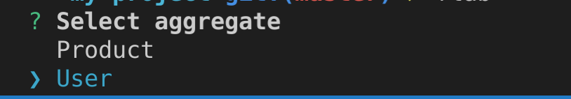
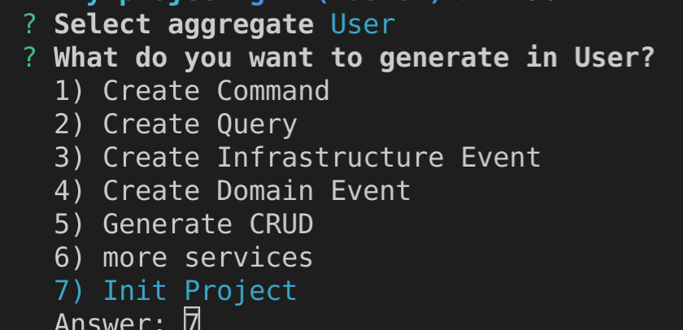
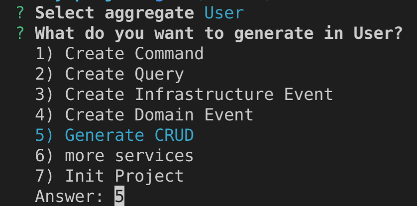

# GENERATE CODE

## install

```bash
npm install -g generate-code-ddd --production
```

## Iniciar un projecto con nest grapql
pre requisitos, para la base de datos se usa firestore, debes tener instalado java
```bash
npm install -g firebase-tools @nestjs/cli
```

iniciamos un proyecto con el CLI de nestjs
```bash
nest new my-project
```
```bash
cd my-project

npm install --save @nestjs/cqrs @nestjs/graphql graphql apollo-server-express@2.x.x class-validator class-transformer base-ddd firebase-admin

npm i faker @types/faker --save-dev
```
### 2.- remove generate files
```bash
rm src/app.controller.ts && rm src/app.controller.spec.ts && rm src/app.service.ts && rm test/app.e2e-spec.ts
```

### 3.- replace src/app.module.ts

```javascript
import { Module } from '@nestjs/common';
import { GraphQLModule } from '@nestjs/graphql';
import { CqrsModule } from '@nestjs/cqrs';
import { UserModule } from './user/user.module';
import { ShareModule } from './share/share.module';

@Module({
  imports: [
    GraphQLModule.forRoot({
      autoSchemaFile: true,
      playground: true,
      debug: true,
    }),
    CqrsModule,
    UserModule,
    ShareModule,
  ],
  controllers: [],
  providers: [],
})
export class AppModule {}

```

### 4.- replace src/main.ts

```javascript
import { NestFactory } from '@nestjs/core';
import { AppModule } from './app.module';
import { ValidationPipe } from '@nestjs/common';

async function bootstrap() {
  const app = await NestFactory.create(AppModule);
  app.useGlobalPipes(
    new ValidationPipe({
      whitelist: true,
      transform: true,
      forbidNonWhitelisted: true,
    }),
  );

  app.enableCors({
    origin: '*',
    methods: 'GET,HEAD,PUT,PATCH,POST,DELETE,OPTIONS',
    allowedHeaders: 'Content-Type, Accept, Authorization',
  });
  await app.listen(3000);
}

bootstrap();

```

### 5 eject CLI GENERATOR
```bash
flab
```
Esto se hace solo una vez se generan lso arhcivos necesario para que el proyecto inicie



### 6 generate user crud
```bash
flab
```
Select aggregate user and select "Generate CRUD"



### 7 opcional
change file ".prettierrc"
```json
{
  "singleQuote": true,
  "trailingComma": "all",
  "printWidth": 120
}
```

## run
```bash
make run
```
open [http://localhost:3000/graphql](http://localhost:3000/graphql)

## test
important!! update "package.json" add "--runInBand --verbose" in test:e2e script
```json
"test:e2e": "jest --runInBand --verbose --config ./test/jest-e2e.json"
```
run test
this command run : format, lint, init test and e2e test
```bash
make
```

## Development tool

----
```
npm i -g generate-code-ddd
```
----

## Example
```yaml
path: src/user
nameSpace: app.user
name: User
properties:
  id: id
  name: string
  lastName:
    type: string
    required: false
  birthdate: date
  emails : string[]
  address: User:Address
  phones: 
    type: User:Phone[]
    min: 1
entity:
  - name: Phone
    properties:
      id: id
      number: integer
valueObject:
  - name: Address
    properties:
      street: string
      number: integer
message:
  User:name:
    required: "El nombre es requerido"
    valid: "El nombre no es un valor válido"
  User:phones:number:
    required: "El numero del celular es requerido"
  User:address:street:
    required: "El nombre de avenida es requerida"
  User:phones:
    min: " al menos un telefono"
event: user
repository:
  pk: id
  table: user
  columnName:
    User:id: id
    User:name: name
    User:lastName: last_name
    User:birthdate: birthdate
    User:emails: emails
    User:address:street: address_street
    User:address:number: address_number
    User:phones: phones
```

## Parámetros
| Param       | Description                                                   | required | Default                           |
| ----------- | ------------------------------------------------------------- | -------- | --------------------------------- |
| path        | Ruta donde se va a generar el código                          | true     | --                                |
| name        | Nombre del aggregate                                          | true     | --                                |
| nameSpace   | En caso necesario (php, java)                                 | false    | ""                                |
| properties  | Descripción de propiedades deñ aggregate                      | true     | --                                |
| entity      | Descripción de las entidades del agregate                     | false    | []                                |
| valueObject | Descripción de los value objects del agregate                 | false    | []                                |
| messages    | mensajes para la validacion de campos                         | false    | generado por el cli               |
| event       | nombre del los eventos que se van a generar                   | false    | nombre del aggregate en minuscula |
| repository  | configuracion de la base datos                                | false    | generado por el cli               |


## Parámetro **aggregate** y voEntity
Se define el nombre y la lista de propiedades


## Parámetro **properties**

| type        | required default   | default | default values     | more config                | primitive value         | length    | db         |
| ----------- | ------------------ | ------- | ------------------ | -------------------------- | ----------------------- | --------- | ---------- |
| id          | true (no editable) | --      | --                 | --                         | string                  | 36        | string     |
| string      | true               | null    | empty  o text      | min, max                   | string                  | 255 o máx | string     |
| text        | true               | null    | empty  o text      | min, max                   | string                  | max       | text       |
| uuid        | true               | null    | random o uuid      | --                         | string                  | 36        | string     |
| date        | true               | null    | now    o date      | min, max                   | Date                    | ---       | dateTime   |
| integer     | true               | null    | zero   o int       | min, max                   | Integer                 | ---       | integer    |
| double      | true               | null    | zero   o Double    | min, max                   | Double                  | ---       | double     |
| enum        | true               | null    | firstValue o value | values                     | string                  | ---       | string     |
| entity      | true               | --      | --                 | --                         | depende de la entity    | ---       | relation   |
| valueObject | true               | --      | --                 | --                         | depende del valueObject | ---       | add column |
| any[]       | true               | []      | []                 | min, max, eachMin, eachMax | array                   | ---       | json       |

> [!NOTE]
> any[] : cuando se pasa un array, la data se guarda en formato json

> [!NOTE]
> entity : en al db se crea una relacion con otra entidad

> [!NOTE]
> valueObject : en al db se crea columnas para guardar la data

### id
este parametro es muy poco configurable, es obligatorio y es de tipo uuid

### string
```yaml
type: string
required: false
default: null
min: 3
max: 20
```
```yaml
type: string
required: true
default: empty
```

### valueObject
```yaml
type: User:Address:Name
type: User:Address:Name[]
```

### entity
```yaml
type: User:Comment
type: User:Comment[]
```

### enum
```yaml
type: enum
required: true
values: [item1,item2,item3]
```


## Fase 1, se inicia considerando un solo agregate y campos individuales

## Example
```yaml
path: src/user
nameSpace: app.user
name: User
properties:
  id: id
  name: string
  lastName:
    type: string
    required: false
  birthdate: date
message:
  User:name:
    required: "El nombre es requerido"
    valid: "El nombre no es un valor válido"
event: user
repository:
  pk: id
  table: user
  columnName:
    User:id: id
    User:name: name
    User:lastName: last_name
    User:birthdate: birthdate
```


```bash
nest g s modules/load-data/application/ymlToJson
```

